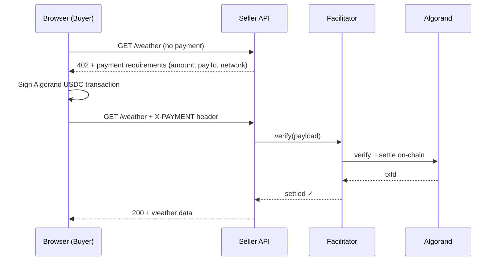

# x402 × Algorand — Hackathon Template

This demo shows how a **buyer** and a **seller** can transact directly over HTTP using the x402 payment protocol — no payment processor, no API keys, no subscription required. The idea is simple: the seller has something valuable, the buyer pays exactly what it costs, and the exchange happens in a single request cycle.

In this example, the **seller** is a weather API. It charges $0.001 USDC per request and only returns data after a valid on-chain payment has been confirmed. The **buyer** is a React app — the user connects with their email (no seed phrase), and the wallet signs the payment automatically in the background. From the user's perspective it feels like a normal API call; under the hood, an Algorand USDC transaction was signed, submitted, and settled in real time.

The point isn't the weather data — it's the pattern. Any API can become a pay-per-use service by adding a few lines of middleware on the seller side, and any client can pay for it with a few lines on the buyer side. This template is meant as a starting point for hackathon participants to replace the weather endpoint with whatever they want to sell.

**Live demo:** [ui-vert-five.vercel.app](https://ui-vert-five.vercel.app)

<!-- Add a screenshot here: drag an image into this file on GitHub, or run the app and paste a screenshot -->
<!--  -->

---

## What this is

```
Browser (React + Web3Auth)
  └── pays seller directly via x402 for each request

seller/  — Hono server with two paid endpoints:
             GET /weather  — current conditions, $0.001 USDC per request
             GET /forecast — 7-day forecast,     $0.005 USDC per request
ui/      — React + Vite SPA, deployed on Vercel

buyer/   — local testing only (see below)
```

The `seller` exposes `GET /weather` and `GET /forecast` behind USDC paywalls. Any client that sends a valid x402 payment proof gets the data. The `ui` demonstrates a browser-based buyer using Web3Auth (email login, no seed phrase).

---

## Prerequisites

Before you start, make sure you have:

- **Node.js 18+** and **npm 9+**
- **An Algorand testnet wallet address** — this becomes `SELLER_ADDRESS`, the address that receives payments. Create one with [Lora](https://lora.algokit.io/testnet) or [Defly](https://defly.app)
- **Testnet ALGO** in that wallet (at least 0.5 ALGO for fees) — [bank.testnet.algorand.network](https://bank.testnet.algorand.network)
- **A Web3Auth account and Client ID** — sign up at [dashboard.web3auth.io](https://dashboard.web3auth.io), create a project on **Sapphire Devnet**, and copy the Client ID
- **Vercel CLI** (for deploying the UI) — `npm i -g vercel`

---

## Quickstart

### 1. Clone and install

```bash
git clone https://github.com/camohe90/x402.git
cd x402
npm install
```

### 2. Configure environment

```bash
cp .env.example .env
```

Edit `.env` (in the repo root):

| Variable | Required | Description |
|---|---|---|
| `SELLER_ADDRESS` | ✅ seller | Algorand address that receives payments |
| `VITE_WEB3AUTH_CLIENT_ID` | ✅ ui | From [dashboard.web3auth.io](https://dashboard.web3auth.io) |
| `VITE_SELLER_URL` | ✅ ui | Public seller URL the browser calls |
| `UI_ORIGIN` | ✅ seller | Deployed UI origin (for CORS, e.g. `https://your-app.vercel.app`) |
| `BUYER_MNEMONIC` | ⚠️ optional | 25-word mnemonic — only needed if running the buyer server |
| `FACILITATOR_URL` | — | Default: `https://facilitator.goplausible.xyz` |
| `SELLER_WEATHER_PRICE` | — | Default: `0.001` (plain decimal USD, no `$`) |
| `SELLER_FORECAST_PRICE` | — | Default: `0.005` (plain decimal USD, no `$`) |

### 3. Run locally

```bash
npm run seller    # terminal 1 — port 4021 (required)
npm run ui        # terminal 2 — port 5173 (required)
```

The buyer server is optional for local dev — skip it unless you need server-to-server testing:

```bash
npm run buyer:server    # optional — port 4022, requires BUYER_MNEMONIC
```

> The browser-based UI calls the seller directly, so it needs a public URL (not localhost). Use ngrok for local dev — see [Connecting a local seller to the deployed UI](#connecting-a-local-seller-to-the-deployed-ui).

---

## Build your own x402 API

### Protect any endpoint (seller side)

```typescript
// seller/src/index.ts
import { paymentMiddleware, x402ResourceServer } from '@x402/hono';
import { HTTPFacilitatorClient } from '@x402/core/server';
import { ExactAvmScheme } from '@x402/avm/exact/server';
import { ALGORAND_TESTNET_CAIP2 } from '@x402/avm';

const facilitator = new HTTPFacilitatorClient({ url: 'https://facilitator.goplausible.xyz' });
const resourceServer = new x402ResourceServer(facilitator)
  .register(ALGORAND_TESTNET_CAIP2, new ExactAvmScheme());

// Define your routes — this is all you need to add a paywall
const routes = {
  'GET /your-endpoint': {
    accepts: {
      scheme: 'exact',
      network: ALGORAND_TESTNET_CAIP2,
      payTo: process.env.SELLER_ADDRESS,
      price: '$0.001',           // any USD amount
    },
  },
};

app.use(paymentMiddleware(routes, resourceServer));

// Your route — only reachable after a valid payment
app.get('/your-endpoint', (c) => c.json({ data: 'your data here' }));
```

### Pay for any x402 endpoint (client side)

```typescript
// ui/src/hooks/useBuyer.ts
import { wrapFetchWithPayment, x402Client } from '@x402/fetch';
import { ExactAvmScheme } from '@x402/avm/exact/client';
import { toClientAvmSigner, ALGORAND_TESTNET_CAIP2 } from '@x402/avm';

const signer = toClientAvmSigner(account.privateKeyBase64);
const client = new x402Client()
  .register(ALGORAND_TESTNET_CAIP2, new ExactAvmScheme(signer));

const fetchWithPayment = wrapFetchWithPayment(fetch, client);

// Payment is handled automatically when the server returns 402
const response = await fetchWithPayment('https://your-api.com/endpoint');
const data = await response.json();
```

---

## Payment flow



---

## Hackathon ideas

| Idea | What to change |
|---|---|
| **AI API gateway** | Replace the weather handler with an LLM call; charge per request or per token |
| **Real-time data** | Stock prices, sports scores, IoT sensor readings — charge per fetch |
| **Geo / mapping** | Geocoding, routing, or satellite imagery on demand |
| **Secrets vault** | Encrypt a payload; return the decryption key only after payment |
| **Media streaming** | Pay-per-minute audio or video segments |
| **Document generation** | PDFs, reports, or AI summaries billed per generation |

In every case, the only files you need to touch are:
- **`seller/src/index.ts`** — swap the `/weather` route and handler for your own endpoint
- **`ui/src/hooks/useBuyer.ts`** — change the URL and response type to match your new endpoint

---

## Connecting a local seller to the deployed UI

The browser can't reach `localhost`. Use ngrok to expose the seller:

```bash
npm run seller                    # terminal 1
npx ngrok http 4021               # terminal 2 — copy the https URL

# In Vercel dashboard → Environment Variables:
# VITE_SELLER_URL = https://<your-ngrok-id>.ngrok-free.app
# Then redeploy:
cd ui && vercel --prod
```

---

## Deploy

**UI → Vercel**

```bash
cd ui
vercel --prod
```

**Seller → Railway**

```bash
cd seller
railway init
railway up
railway domain
# Set VITE_SELLER_URL in Vercel to the Railway URL, then redeploy the UI
```

---

## About the buyer server

`buyer/` is a **server-side x402 client** — a Hono SSE server that purchases from the seller using a funded mnemonic and streams the events back to the browser. It is **only used for local development and testing**, not required in production.

When the UI is deployed to Vercel, the browser calls the seller directly using the Web3Auth-derived wallet. The buyer server is not needed and is not deployed.

| Scenario | Needs buyer server? |
|---|---|
| Running locally (`npm run ui`) | Optional — UI calls seller directly anyway |
| Deployed UI on Vercel | **No** — browser pays directly via Web3Auth wallet |
| Server-to-server testing (no browser) | **Yes** — useful for scripted load tests or CI |
| Building a backend agent that consumes x402 APIs | **Yes** — use `buyer/` as your starting point |

To skip the buyer server entirely, just run `npm run seller` and `npm run ui`. The `BUYER_MNEMONIC` env variable is only required if you run `npm run buyer:server`.

---

## Troubleshooting

**CORS error when clicking Buy**
The browser is calling a seller URL that isn't publicly accessible, or the `UI_ORIGIN` env var doesn't match your deployed UI's domain. Make sure `VITE_SELLER_URL` points to a public URL (Railway, ngrok, etc.) and that the seller has been restarted after updating `UI_ORIGIN`.

**"Need at least 0.2 ALGO" warning**
Your wallet needs ALGO to cover Algorand fees and the USDC opt-in minimum reserve. Fund it at [bank.testnet.algorand.network](https://bank.testnet.algorand.network), then wait ~5 seconds and refresh.

**"Insufficient USDC balance"**
Once you have ALGO, the app auto opts-in to USDC (ASA `10458941`). After opt-in, get testnet USDC from [faucet.circle.com](https://faucet.circle.com). Make sure you select **Algorand Testnet** in the faucet.

**402 received — 0 USDC required** (in the event log)
The seller's `PAYMENT-REQUIRED` response header isn't reaching the browser. Check that the seller's CORS `exposeHeaders` includes `PAYMENT-REQUIRED`, and that the seller has been redeployed after any config changes.

**Web3Auth modal doesn't open**
The `VITE_WEB3AUTH_CLIENT_ID` is missing or incorrect, or the Client ID was created on the wrong network (must be **Sapphire Devnet** for testnet). Verify in the [Web3Auth dashboard](https://dashboard.web3auth.io).

**Railway deploy fails**
Make sure `.env` values are set as Railway environment variables (not just in the local `.env` file). Set `SELLER_ADDRESS`, `FACILITATOR_URL`, and `UI_ORIGIN` in the Railway dashboard under your service's Variables tab.

---

## Key packages

| Package | Used in | Purpose |
|---|---|---|
| `@x402/hono` | seller | `paymentMiddleware`, `x402ResourceServer` |
| `@x402/fetch` | buyer, ui | `wrapFetchWithPayment`, `x402Client` |
| `@x402/avm` | buyer, ui | `toClientAvmSigner`, `ExactAvmScheme`, `ALGORAND_TESTNET_CAIP2` |
| `@web3auth/modal` v10 | ui | Email-based wallet, no seed phrase |
| `@algorandfoundation/algokit-utils` | ui | `AlgorandClient.testNet()`, USDC opt-in |

---

## Testnet resources

- **ALGO faucet:** [bank.testnet.algorand.network](https://bank.testnet.algorand.network)
- **USDC faucet:** [faucet.circle.com](https://faucet.circle.com)
- **Explorer:** [lora.algokit.io/testnet](https://lora.algokit.io/testnet)
- **Facilitator:** [facilitator.goplausible.xyz](https://facilitator.goplausible.xyz)
- **USDC ASA:** `10458941` on Algorand Testnet (6 decimals)

---

## License

MIT
